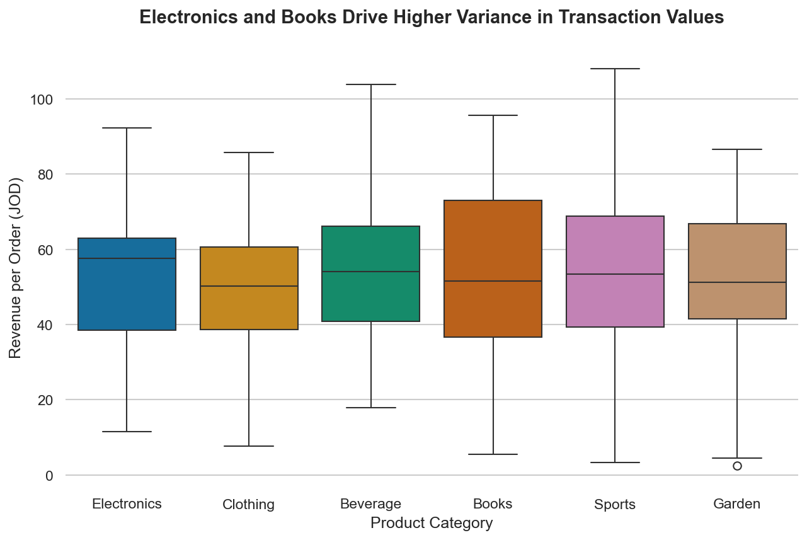

# Analysis of Revenue Variance Across Product Categories

### The Visualization

### Data Finding
Through a boxplot analysis of the **Amman Market dataset**, I investigated how revenue is distributed across different product categories. The key finding is that while categories like **Electronics** and **Books** are major revenue drivers, they exhibit significantly higher variance and more extreme outliers compared to **Beverages** or **Sports**. This indicates that revenue in these sectors is driven by occasional high-value transactions rather than consistent price points. 

### Why It Matters
Understanding this variance allows for more targeted inventory and marketing strategies. Instead of applying a uniform pricing strategy, the business should focus on premium marketing for high-variance categories to capture more "high-ticket" sales, while maintaining steady volume-based promotions for stable categories like Beverages.